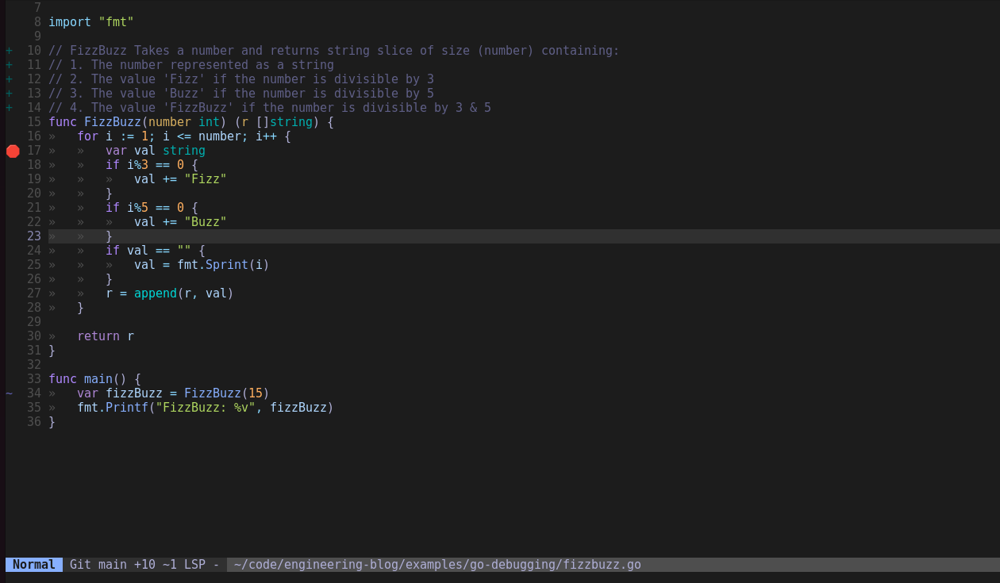
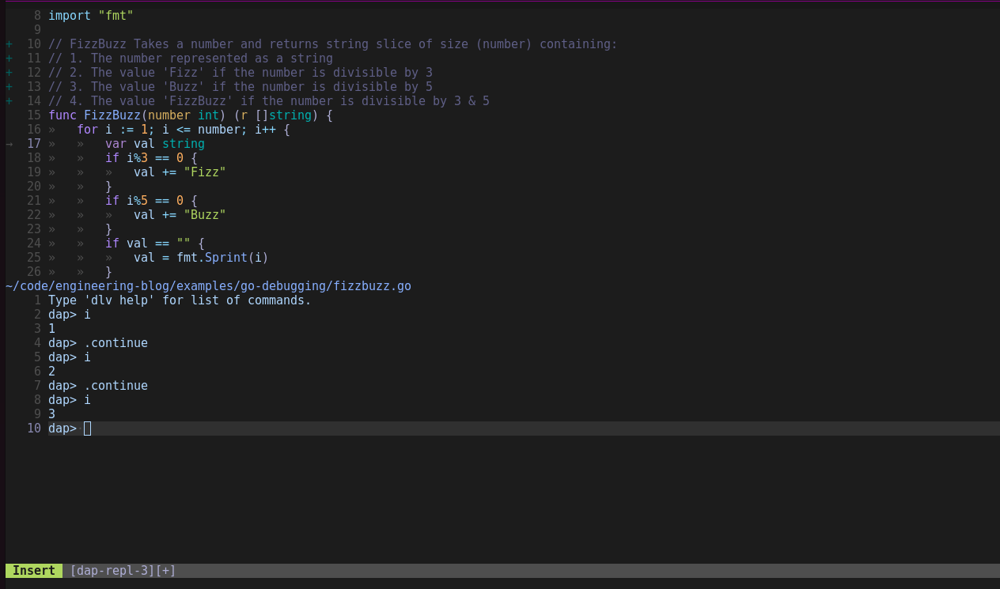

# About 

This section contains a basic implementation of [fizz-buzz](https://leetcode.com/problems/fizz-buzz/), which is a basic program implementation. The purpose of this code is to demonstrate how to leverage the Delv debugger in conjunction with a Debug Adapter Protocol (DAP) client to seamlessly debug `go` code from neovim. 

## Dependencies

* [go version 1.21.9](https://go.dev/doc/manage-install)
* [nix package manager (optional)](https://nixos.org/download/)
* [dlv](https://github.com/go-delve/delve/tree/master)

This example contains within it a [shell.nix](./shell.nix) file which is used by the [nix package manager](https://nixos.org/). Nix is a tool for creating virtual environments independent of the global configurations.

If you have nix installed, then you can run the following command within this directory:

```sh
$ nix-shell
```

This will install `go` version 1.22.3. To confirm it works you can run:

```sh
$ go version
# If everything worked as expected you should see an output similar to this:
go version go1.22.3 linux/amd64
```

Note that the `go` version installed in the nix-shell environment will only be available while in th nix-shell. To exit the nix shell, either just close the terminal or type exit to return to the standard terminal environment.

You will also need to [install dlv](https://github.com/go-delve/delve/tree/master/Documentation/installation). 

```sh
$ go install github.com/go-delve/delve/cmd/dlv@latest
```

Assuming everything went as expected you should be able to run:

```sh

$ dlv version
# This will be the output
Delve Debugger
Version: 1.22.1
Build: $Id: 0c3470054da6feac5f6dcf3e3e5144a64f7a9a48 $
```

## Debug with Delve

Using what we have so far we can launch the `dlv` debugger to debug our `FizzBuzz` application. We can do this by running:

```sh
dlv debug fizzbuzz.go                                                                                                                                                                                                                                                                                                                          17:17:45
# This will start the dlv debug repl.
Type 'help' for list of commands.
(dlv)

```

If we just type continue the program will execute as expected and we will get an output similar to this:

```sh

Type 'help' for list of commands.
(dlv) continue
FizzBuzz: [1 2 Fizz 4 Buzz Fizz 7 8 Fizz Buzz 11 Fizz 13 14 FizzBuzz]Process 664097 has exited with status 0

```

This is, of course, not that interesting given that we could have gotten much the same output using the standard `go run` command or `go build` command.

Lets try this again, but lets put in some breakpoints in the code, and inspect the values:

```sh
          17:34:35
Type 'help' for list of commands.
(dlv) break mybreak fizzbuzz.go:25
Breakpoint mybreak set at 0x49816b for main.main() ./fizzbuzz.go:25
(dlv) continue
> [mybreak] main.main() ./fizzbuzz.go:25 (hits goroutine(1):1 total:1) (PC: 0x49816b)
    20:         return r
    21: }
    22:
    23: func main() {
    24:         var fizzBuzz []string = FizzBuzz(15)
=>  25:         fmt.Printf("FizzBuzz: %v", fizzBuzz)
    26: }
(dlv) fizzBuzz
Command failed: command not available
(dlv) print fizzBuzz
[]string len: 15, cap: 16, [
        "1",
        "2",
        "Fizz",
        "4",
        "Buzz",
        "Fizz",
        "7",
        "8",
        "Fizz",
        "Buzz",
        "11",
        "Fizz",
        "13",
        "14",
        "FizzBuzz",
]
(dlv)
```

So the first thing we did from the output above was start the debug session like before, but this time we set a breakpoint in the code on [line 25](https://github.com/thomasbellio/engineering-blog/blob/12069d3165fa4aa81765e2c93b24568c6e193887/examples/go-debugging/fizzbuzz.go#L25).

We set the break point using `break myBreak fizzbuzz.go:25`, this command `break` creates a breakpoint named `myBreak` and tells `dlv` that the breakpoint should be put on line 25 of the file `fizzbuzz.go`.

Once the breakpoint is in place we can run `continue` , just like before except this time instead of running the program and exiting the execution stops on line 25, and it will wait there until it receives further instruction. As a way to demonstrate how we can inspect variables in the dlv repl we executed the `print fizzBuzz` command. You will notice in the code that there is a variable defined on line 24 called `fizzBuzz`. So while the program is paused we can inspect values of  variables among [many other things](https://github.com/go-delve/delve/blob/master/Documentation/cli/README.md)

In addition to executing on the main program for a module we can also use Delve to debug our tests, which I will show next. In this example we have a test called `TestFizzBuzz` which is defined in a file called `fizzbuzz_test.go`. 

```sh
Type 'help' for list of commands.
(dlv) break TestFizzBuzz
Breakpoint 1 set at 0x562553 for go-debugging.TestFizzBuzz() ./fizzbuzz_test.go:8
(dlv) contineu
Command failed: command not available
(dlv) continue
> go-debugging.TestFizzBuzz() ./fizzbuzz_test.go:8 (hits goroutine(20):1 total:1) (PC: 0x562553)
     3: import (
     4:         "reflect"
     5:         "testing"
     6: )
     7:
=>   8: func TestFizzBuzz(t *testing.T) {
     9:         number := 15
    10:
    11:         want := []string{
    12:                 "1",
    13:                 "2",
(dlv) step
> go-debugging.TestFizzBuzz() ./fizzbuzz_test.go:9 (PC: 0x562562)
     4:         "reflect"
     5:         "testing"
     6: )
     7:
     8: func TestFizzBuzz(t *testing.T) {
=>   9:         number := 15
    10:
    11:         want := []string{
    12:                 "1",
    13:                 "2",
    14:                 "Fizz",
(dlv) step
> go-debugging.TestFizzBuzz() ./fizzbuzz_test.go:11 (PC: 0x56256b)
     6: )
     7:
     8: func TestFizzBuzz(t *testing.T) {
     9:         number := 15
    10:
=>  11:         want := []string{
    12:                 "1",
    13:                 "2",
    14:                 "Fizz",
    15:                 "4",
    16:                 "Buzz",
(dlv) print number
15
(dlv) break mybreak fizzbuzz_test.go:30
Breakpoint mybreak set at 0x562921 for go-debugging.TestFizzBuzz() ./fizzbuzz_test.go:30
(dlv) contineu
Command failed: command not available
(dlv) continue
> [mybreak] go-debugging.TestFizzBuzz() ./fizzbuzz_test.go:30 (hits goroutine(20):1 total:1) (PC: 0x562921)
    25:                 "14",
    26:                 "FizzBuzz",
    27:         }
    28:         got := FizzBuzz(number)
    29:
=>  30:         if !reflect.DeepEqual(got, want) {
    31:                 t.Errorf("wanted %v, got %v ", want, got)
    32:         }
    33: }
(dlv) print got
[]string len: 15, cap: 16, [
        "1",
        "2",
        "Fizz",
        "4",
        "Buzz",
        "Fizz",
        "7",
        "8",
        "Fizz",
        "Buzz",
        "11",
        "Fizz",
        "13",
        "14",
        "FizzBuzz",
]
(dlv) print want
[]string len: 15, cap: 15, [
        "1",
        "2",
        "Fizz",
        "4",
        "Buzz",
        "Fizz",
        "7",
        "8",
        "Fizz",
        "Buzz",
        "11",
        "Fizz",
        "13",
        "14",
        "FizzBuzz",
]
(dlv) continue
PASS
Process 680204 has exited with status 0
(dlv) exit

```

The first thing we do is run the `dlv test` command from the root of this directory. If we had a different structure or were trying to debug an application at a different path we could have passed the full path to the module like:

```sh
dlv test github.com/me/foo/pkg/baz
```

But since the program we are debugging is in the current directory, we can omit that extra parameter.

Lets break down the commands that we executed.

The first thing we did in the line above was put a break point on the test.

```sh
(dlv) break TestFizzBuzz
```

Then we executed the `continue` command which will tell delve to execute until the end of the program or the next breakpoint, in this case it will stop at the test function where we told it to break:

```sh
(dlv) continue
> go-debugging.TestFizzBuzz() ./fizzbuzz_test.go:8 (hits goroutine(20):1 total:1) (PC: 0x562553)
     3: import (
     4:         "reflect"
     5:         "testing"
     6: )
     7:
=>   8: func TestFizzBuzz(t *testing.T) {
     9:         number := 15
    10:
    11:         want := []string{
    12:                 "1",
    13:                 "2",
(
```
Because we set the breakpoint on the test when we execute `continue` it will automatically stop on the test in question. Then once the execution is stopped we can either continue to the end or the next break point or we can use the `step` command:

```sh
(dlv) step
> go-debugging.TestFizzBuzz() ./fizzbuzz_test.go:9 (PC: 0x562562)
     4:         "reflect"
     5:         "testing"
     6: )
     7:
     8: func TestFizzBuzz(t *testing.T) {
=>   9:         number := 15
    10:
    11:         want := []string{
    12:                 "1",
    13:                 "2",
    14:                 "Fizz",
(dlv) step
> go-debugging.TestFizzBuzz() ./fizzbuzz_test.go:11 (PC: 0x56256b)
     6: )
     7:
     8: func TestFizzBuzz(t *testing.T) {
     9:         number := 15
    10:
=>  11:         want := []string{
    12:                 "1",
    13:                 "2",
    14:                 "Fizz",
    15:                 "4",
    16:                 "Buzz",
(
```

The `step` command will execute the next instruction in the program, in our case the first step stopped on the `number` variable assignment, then we execute the `step` function again and it moves on to the assignment of the expected string array on line 11.

Just as before we can create a breakpoint in the test. In our case on [line 30](https://github.com/thomasbellio/engineering-blog/blob/12069d3165fa4aa81765e2c93b24568c6e193887/examples/go-debugging/fizzbuzz_test.go#L30) this is done the same as it was done in the main file from above:

```sh
(dlv) break mybreak fizzbuzz_test.go:30
Breakpoint mybreak set at 0x562921 for go-debugging.TestFizzBuzz() ./fizzbuzz_test.go:30
(dlv) contineu
Command failed: command not available
(dlv) continue
> [mybreak] go-debugging.TestFizzBuzz() ./fizzbuzz_test.go:30 (hits goroutine(20):1 total:1) (PC: 0x562921)
    25:                 "14",
    26:                 "FizzBuzz",
    27:         }
    28:         got := FizzBuzz(number)
    29:
=>  30:         if !reflect.DeepEqual(got, want) {
    31:                 t.Errorf("wanted %v, got %v ", want, got)
    32:         }
    33: }
(
```

Then as we continue it will stop on the location of our breakpoint and we can then inspect some of the variables using the print commad: 

```sh
(dlv) print got
[]string len: 15, cap: 16, [
        "1",
        "2",
        "Fizz",
        "4",
        "Buzz",
        "Fizz",
        "7",
        "8",
        "Fizz",
        "Buzz",
        "11",
        "Fizz",
        "13",
        "14",
        "FizzBuzz",
]
(dlv) print want
[]string len: 15, cap: 15, [
        "1",
        "2",
        "Fizz",
        "4",
        "Buzz",
        "Fizz",
        "7",
        "8",
        "Fizz",
        "Buzz",
        "11",
        "Fizz",
        "13",
        "14",
        "FizzBuzz",
]
(dlv) continue
PASS
Process 680204 has exited with status 0
(dlv) exit
```

These are the basics of using the Delve debugger and just using the debugger from the command line could be pretty valuable, but often times it is nice to be able to leverage toolsets within the context of your IDE. I personally use `neovim` as my editor of choice so I am going to talk about how to integrate the debugger into `neovim` next. 


## Debug Adapter Protocol (DAP)

Now that we have used Delve to debug an application, the next question becomes obvious. How can I do this as a part of my standard development workflow? How can I integrate the debugger into my editor? 

This is where something called the [Debug Adapter Protocol (DAP)](https://microsoft.github.io/debug-adapter-protocol/) comes in handy. The Debug Adapter Protocol (DAP) is a protocol to support editors and other clients to be able to integrate with a variety of different debuggers. The debug adapter protocol creates a standardized approach to communicating with debuggers, whether they be for `go` as in the case of [Delve](https://github.com/go-delve/delve/tree/master) or any other debugger that supports DAP. The DAP is the glue between the client (in this case neovim) and the underlying debugger. 

For this write up we will leverage a tool called [nvim-dap](https://github.com/mfussenegger/nvim-dap), which is a DAP implementation specifically for neovim. 

To further congeal the point consider this table from the [nvim-dap documentation](https://github.com/mfussenegger/nvim-dap/blob/master/doc/dap.txt) it shows what is needed to support a debugger using DAP:

| DAP Client | Debug Adapter | Debugger | Debugee  |
|------------|---------------|----------|----------|
| nvim-dap   | delve         | delve    | fizzbuzz |

In order to support DAP we need 4 things: 

1. A DAP client, which in our case is an implementation supported by neovim-dap. 
2. A debug adapter. A debug adapter can be used in several different modes, but for our purposes in this example we will be using a server implementation of the debug adapter protocol supported by Delve. In short one can think of the debug adapter as a server frontend for the underlying debugger in our case `Delve` is able to serve as the debug adapter and the debugger. 
3. The third thing we have is a debugger, which we demonstrated above using `Delve`.
4. Finally we need an application to debug, in our case we are debugging the application `fizzbuzz`. 

## Configuring nvim-dap

Configuring [nvim-dap](https://github.com/mfussenegger/nvim-dap) may be slightly different depending on how you manage plugins in neovim. In my case I leverage [lazy vim](https://www.lazyvim.org/). In my `init.lua` file for `neovim` I have the following configuration:


```lua
{
    'mfussenegger/nvim-dap',
    opts = {},
    config = function()
      local dap = require 'dap'
      dap.adapters.go = {
        type = 'server',
        port = '${port}',
        executable = {
          command = 'dlv',
          args = { 'dap', '--listen', '127.0.0.1:${port}', 'launch', 'debug', '${file}' },
        },
      }
      dap.configurations.go = {
        {
          type = 'go',
          request = 'launch',
          name = 'Launch File',
          program = '${file}',
        },
      }
    end,
  },
```

The specifics here are [documented on github in the nvim-dap repository](https://github.com/mfussenegger/nvim-dap), but let me talk a bit about what is happening in the configuration. The first is the `dap.adapters.go` section. In this section we are defining how to launch the dap server (server is one of the options in thee `type` parameter the options are [documented here](https://github.com/mfussenegger/nvim-dap/blob/master/doc/dap.txt), the options are 'executable|sever|pipe').  As mentioned above the DAP server is the middle piece between the debugger (dlv) and the client (nvim-dap).

The second part might be considered like a 'profile', this is setting up the various configurations that we may be able to run. The configuration in this example is telling the client to launch the current ${file}, which is one of the reserved variables as a part of nvim-dap.

In addition to the configuration above I have also incorporated some key binding that act as shortcuts for common debug patterns. 

You can see these mappings in [context here](https://github.com/thomasbellio/kickstart.nvim/blob/master/lua/keymaps.lua) and I have included them below for reference:

```lua
vim.keymap.set('n', '<F5>', function()
  require('dap').continue() # Will start a debug session or continue one on a break point
end)
vim.keymap.set('n', '<F10>', function()
  require('dap').step_over() # Steps over the code where the debugger is currently stopped
end)
vim.keymap.set('n', '<F11>', function()
  require('dap').step_into() # Will step into a function call
end)
vim.keymap.set('n', '<F12>', function()
  require('dap').step_out() # Will Step out of the current function
end)
vim.keymap.set('n', '<Leader>b', function()
  require('dap').toggle_breakpoint() # Flips a break point on or off
end)
vim.keymap.set('n', '<Leader>B', function()
  require('dap').set_breakpoint() # Sets a breakpoint
end)
vim.keymap.set('n', '<Leader>lp', function()
  require('dap').set_breakpoint(nil, nil, vim.fn.input 'Log point message: ')
end)
vim.keymap.set('n', '<Leader>dr', function()
  require('dap').repl.open() # will open the repl in the a window 

end)
vim.keymap.set('n', '<Leader>dl', function()
  require('dap').run_last()
end)
vim.keymap.set({ 'n', 'v' }, '<Leader>dh', function()
  require('dap.ui.widgets').hover()
end)
vim.keymap.set({ 'n', 'v' }, '<Leader>dp', function()
  require('dap.ui.widgets').preview()
end)
vim.keymap.set('n', '<Leader>df', function()
  local widgets = require 'dap.ui.widgets'
  widgets.centered_float(widgets.frames)
end)
vim.keymap.set('n', '<Leader>ds', function()
  local widgets = require 'dap.ui.widgets'
  widgets.centered_float(widgets.scopes)
end)
```

In addition to the key maps that make it easier to work with the debugger, I have included a special symbol for the breakpoint.

```lua
vim.fn.sign_define('DapBreakpoint', { text = '🛑', texthl = '', linehl = '', numhl = '' })
```

There are other signs that we can define, which I will change in the future. They are all documented in the [nvim-dap](https://github.com/mfussenegger/nvim-dap/blob/6f79b822997f2e8a789c6034e147d42bc6706770/doc/dap.txt#L476C7-L476C20).


Now that we have configured nvim-dap in our editor we can launch the debugger and analyze the program right from the editor.

In this first screenshot you can clearly see where I have set the breakpoint in the code:



I was able to set this break point by using the shortcut `<space>b`, which is made possible by the key mappings configured above.

Next I can start the debug session using `<F5>`, which is also a shortcut that I defined above in the keymaps. Once the debug session has started it will break on my breakpoint and wait for further instructions. I can interact with the debugger using the `dap repl`. I can open the dap repl using `<space>dr`, which is a keyboard shortcut defined in the keymaps above. 


As you can see from the image above, while the program is executing I can interact with the debugger and inspect variables. 

First I inspect the value of `i` where it equals `1`, then I call the `.continue` command which will cause the program to execute until the end or the next breakpoint. 

I then inspect `i` again and as expected it has been incremented by 1.

Once all these components are in place it makes it really simple to debug applications from nvim.


## Conclusion

It took me a minute to understand how all the components the `DAP client`, `DAP server`, `Debugger`, and `Application` all interacted to make all this work. Once I understood the components involved the setup wasn't particularly difficult and it makes launching the debugger a breeze. Because we are using a DAP client, this same configuration will work for other languages like `Python`, we would just need to adjust the configurations to support other language debuggers. This really adds a lot of capability to `neovim` and will make exploring unknown code bases much less daunting.   


